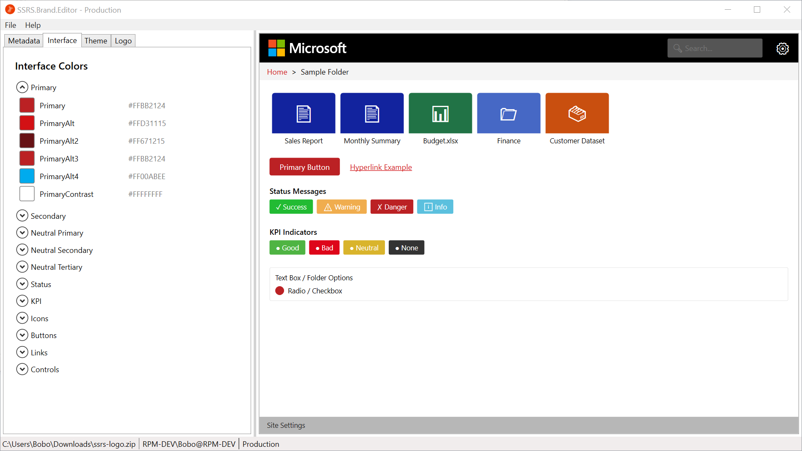

# SSRS.Brand.Editor

The SSRS Brand Editor is a desktop application designed to simplify the process of customizing and managing branding for SQL Server Reporting Services (SSRS) portals. With an intuitive interface and powerful features, it allows users to easily create, edit, and apply brand packages that include logos, color schemes, and other visual elements to enhance the appearance of their SSRS portals. Whether you're looking to align your reporting environment with your organization's branding guidelines or simply want to give your SSRS portal a fresh new look, the SSRS Brand Editor provides the tools you need to achieve professional results with ease.

## Features

- **User-Friendly Interface**: The application offers an intuitive and easy-to-navigate interface, making it accessible for users of all skill levels.
- **Brand Package Management**: Create, edit, and manage brand packages that include logos, color schemes, and other visual elements for your SSRS portals.
- **Preview Functionality**: Preview your branding changes in real-time before applying them to your SSRS portals, ensuring that you achieve the desired look and feel.
- **Compatibility**: Designed to work seamlessly with SQL Server Reporting Services, ensuring that your branding changes are applied correctly and efficiently.
- **Export and Import**: Easily export and import brand packages, allowing you to share your branding configurations with colleagues or across different environments.

## Installation

To install the SSRS Brand Editor, follow these steps:

1. Download the latest release from the [Releases] section of the GitHub repository.
2. Run the apllication and open an existing brand package or create a new one to start customizing your SSRS portal.

## Contributing

Contributions to the SSRS Brand Editor are welcome! If you have an idea for a new feature, improvement, or bug fix, please follow these steps:

1. Fork the repository and create a new branch for your contribution.
2. Make your changes and commit them with clear and descriptive messages.
3. Push your changes to your forked repository and submit a pull request to the main repository.

## Code of Conduct

We expect all contributors to adhere to the [Code of Conduct](https://github.com/BoBoBaSs84/SSRS.Brand.Editor/blob/main/CODE_OF_CONDUCT.md).

## License

This project is licensed under the MIT License. See the [LICENSE](https://github.com/BoBoBaSs84/SSRS.Brand.Editor/blob/main/LICENSE) file for more details.
